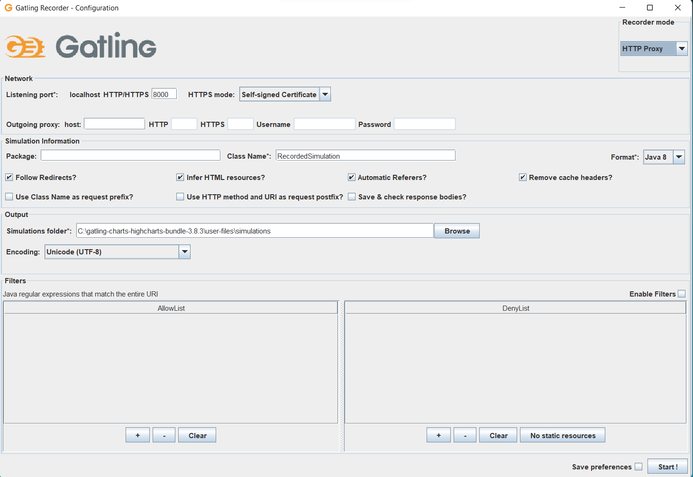
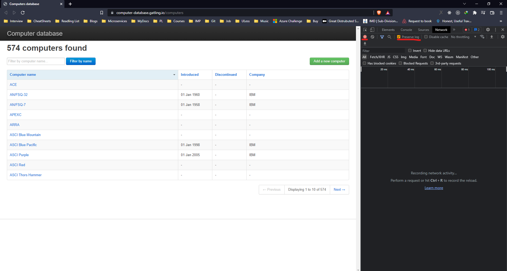
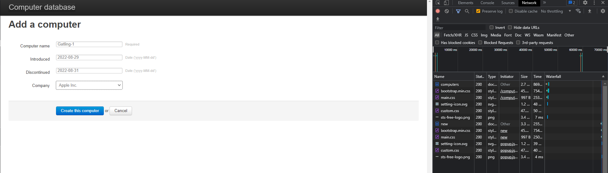
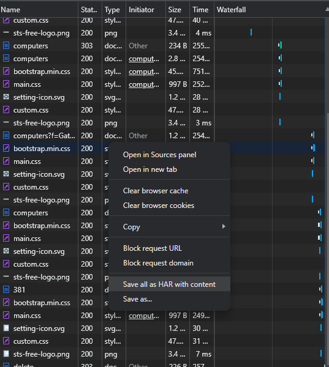
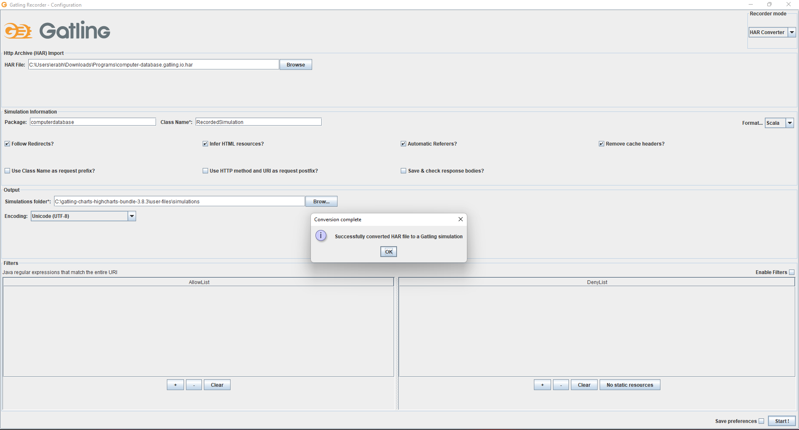
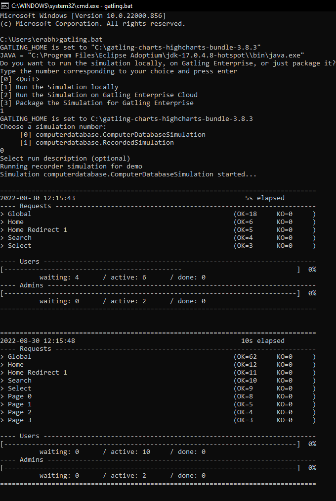

# Gatling recorder

* This ships with gatling bundle. 
* If your environment variable are set correctly then you should be able to run recorder by using **command**: `recorder.bat` and the recorder GUI will open 

* Use the HAR Recorder in the recorder mode drop down and it saves a HAR file which we can import later and run our tests. 
* Additionally you can choose parameters like `package-name, class-name and Java version` in the recorder GUI

## Record User Journey using HAR Recorder
* We will be using gatling test application developed by gatling : https://computer-database.gatling.io/computers
* To record a HAR file open the website and then open the Dev tools. 
* Make sure the recorder is on and preserve logs is checked. 

1. Refresh Page to simulate you landing on the system for first time. 
2. Create a computer by filling details 

3. View/Filter/Delete the computers to simulate various user actions.
4. Save the file as a HAR file by right clicking on dev tools panel. 

5. Import the file in gatling recorder GUI. 
6. Select Scala in the dropdown for format. Enter the package name and class name and click on `start`. This will generate the simulations. 

## Executing the recorder journey
1. Open the command prompt. The simulations will be in bundled folder for gatling in that navigate to simulations folder.
2. In Command prompt run gatling.bat and then select the appropriate menu as per the requirements.

