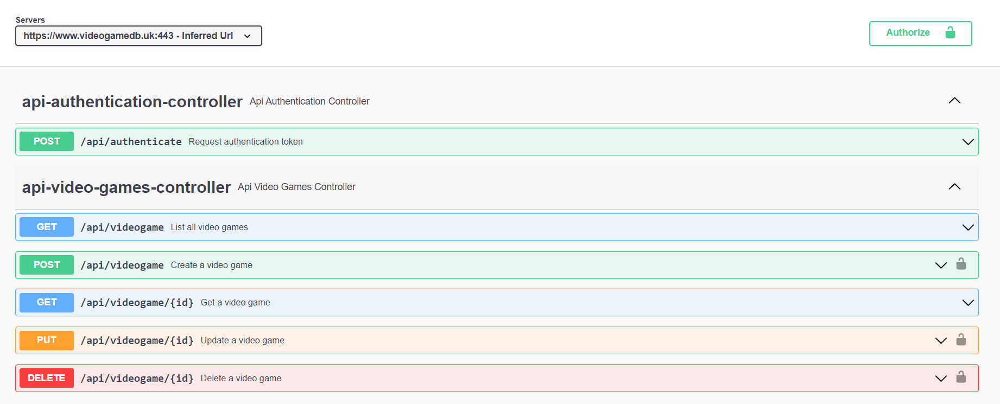

# Dependency Installation and Project Configuration

* API under test: https://www.videogamedb.uk/swagger-ui/index.html 
* API is running in Read Only mode so data will not persisted.

> **NOTE**: Generate a JWT token using /authenticate  API and click authorize button and paste the token so that you dont get unauthorized response for any api calls.

## Pre-requisites
* Java JDK 8, 11, 17 ; Check by running command `java -version`
* Maven Built tools; Check by running command `mvn --version`
* IntelliJ IDEA IDE
* IntelliJ Scala Plugin; In IDE Click `Ctrl + Alt + S` then go to plugins menu search for scala and install.
* Use Scala SDK 2.13.8 or 2.X version 

## Setting up Gatling project
* Easiest way to clone the gatling demo scala repository available on official gatling repository from [here](https://github.com/gatling/gatling-maven-plugin-demo-scala.git) or run the command `git clone https://github.com/gatling/gatling-maven-plugin-demo-scala.git <repository_name_you_want_to_give>`

* then edit the pom.xml file and give the project name in artifactId
* Then open the project in IntelliJ it is going to install all the dependencies for you. 
> **NOTE**: You may get an error Cannot find project scala library to resolve that click on scala file and in top right you will see a link `Setup Scala SDK` click on it and select the right library. 
* Just to verify everything is fine navigate to src > test > scala > Engine.scala and run the file and you should see the test run in the terminal window. 

## Writing Gatling Scripts
1. Create new package in scala folder; give it's name as app-name. 
2. Extend the Simulation class and do the required imports.

```scala
package videogamedb

import io.gatling.core.Predef._
import io.gatling.http.Predef._

class MyFirstTest extends Simulation {

  // 1. Http Configuration

  // 2. Scenario Definitions: Every single step the user is going to take in the system. 

  // 3. Load Scenarios
}

```

3. Implement the various sections of the test scripts 
```scala 
package videogamedb

import io.gatling.core.Predef._
import io.gatling.http.Predef._

class MyFirstTest extends Simulation {

  // 1. Http Configuration

  var httpProtocol = http.baseUrl("https://www.videogamedb.uk:443/api")
    .acceptHeader("application/json")

  // 2. Scenario Definitions

  var scn = scenario("My First Test")
    .exec(http("Get All Games")
    .get("/videogame"))

  // 3. Load Scenarios

  setUp(
    scn.inject(atOnceUsers(1))
  ).protocols(httpProtocol)
}

```